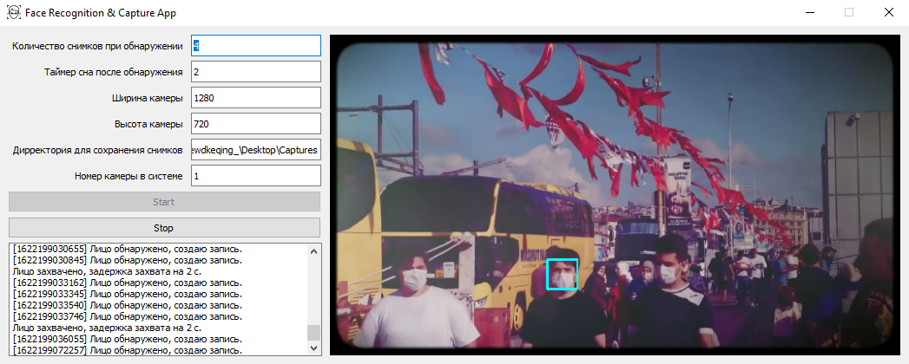
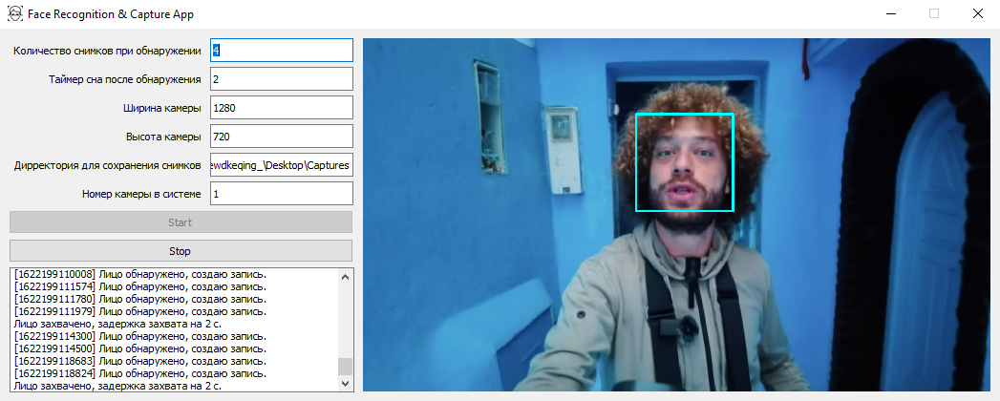

# Face Recognition & Capture App

Face Recognition & Capture App

## Requirements

```
Python 3
pip install PyQt5
pip install opencv-python
```

## About

Программа для обнаружения и логирования лиц на камере. Также вы можете использовать OBS в качестве виртуальной камеры, для захвата лиц из различных источников. Просто установите OBS Virtualcam 2.0.5 в качестве плагина, а затем в Инструментах OBS включите виртуальную камеру.

## Screenshots



